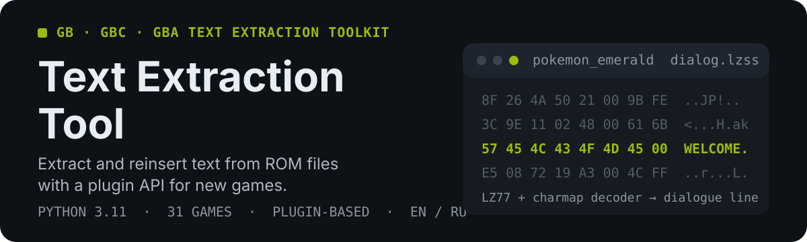

# GB2Text

**GB Text Extraction Tool** — a universal tool for extracting, translating, and reinserting text from Game Boy, Game Boy Color, and Game Boy Advance ROM files, with a plugin system for game-specific configurations.

  

## What it does

- **Extracts** readable text from GB/GBC/GBA ROMs (raw text, pointer tables, LZ77/LZSS/RLE, Huffman)
- **Translates** with a GUI editor, machine-translation integration, and TMX/CSV/XML import-export
- **Reinserts** text back into the ROM, including in-place writes and pointer relocation for supported games
- **Extends** via plugins — 40+ games already covered (see [SUPPORTED_GAMES.md](SUPPORTED_GAMES.md))

## ✨ Features

- Extract text from GB, GBC, and GBA ROM files
- GUI interface for easy text editing and translation
- Support for custom character maps (`.tbl`)
- Automatic text segment detection
- Text injection back into ROM files
- Plugin system for game-specific configurations (offsets, charmaps, pointer tables)
- Pointer relocation and ROM expansion for longer translations
- Multiple languages (English, Japanese, Russian) and encodings
- Agent API layer (`api/`): Python SDK, CLI, and HTTP/JSON server
- Machine-translation integration and TMX/CSV/XML import-export

If you want a translation to Russian, use the `ru` version of any document.

**You can read in more detail by selecting one of the Readme or Contributing options that matches your language.**

## 🌍 Readme

### 🇺🇸 [English](docs/en/README.md)
### 🇷🇺 [Русский](docs/ru/README.md)

## 🗺️ Roadmap

### 🇺🇸 [English](docs/en/ROADMAP.md)
### 🇷🇺 [Русский](ROADMAP.md)

## 🌍 Contributing

### 🇺🇸 [English](docs/en/CONTRIBUTING.md)
### 🇷🇺 [Русский](docs/ru/CONTRIBUTING.md)

## 🧪 Testing

### 🇺🇸 [English](tests/en/README.md)
### 🇷🇺 [Русский](tests/README.md)

## 🤖 Agent API

### 🇺🇸 [English](docs/en/API_AGENTS.md)
### 🇷🇺 [Русский](docs/ru/API_AGENTS.md)

## 🎮 Supported Games

See [SUPPORTED_GAMES.md](SUPPORTED_GAMES.md) for the full table of verified plugins, statuses, and working games.

**This project is available in multiple languages. Please select your preferred language from the links above.**

## ⚠️ Legal Disclaimer

**This project is intended ONLY for analysis of ROM files that you legally own.** 
You must use this tool ONLY with homebrew ROM files that you created yourself or with commercial ROM files that you have legally acquired.

Nintendo, Pokémon, The Legend of Zelda, and all related trademarks are the property of their respective owners.

**This project does NOT contain or distribute any commercial ROM files.**